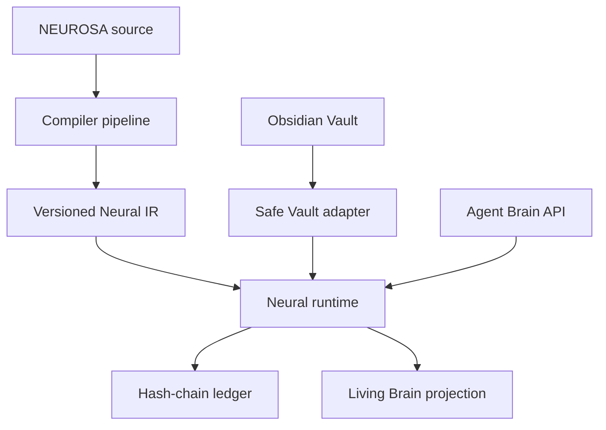

# NEUROSA-HB Architecture Lock v0.1

Status: **LOCKED**  
Product: NEUROSA Human Brain Runtime  
Positioning: Brain for Agentic Runtime  
License: MIT

## 1. Purpose

NEUROSA-HB is an independent, local-first, programmable cognitive layer for agentic runtimes. The v0.1 vertical slice compiles `.nsa` source into deterministic Neural IR, loads it into a bounded event-driven runtime, indexes an Obsidian-compatible Markdown Vault, exposes a framework-neutral Brain API, renders real runtime events, and persists an auditable hash-chain ledger.

It is not an agent, agent framework, generic RAG system, vector database, Hydra dashboard, Hermes module, or Michael Angelo component.

## 2. Primary principle

Persistent, plastic, and auditable cognition. Every mutation requires a computational contract, provenance, policy decision, and ledger evidence. Missing provenance is `UNKNOWN`, never guessed.

## 3. Trust boundaries

1. Operator approval controls persistent inferred relations and Vault writeback.
2. Agents have explicit identities, namespaces, trust, and deny-by-default mutation permissions.
3. Untrusted `.nsa` must pass lexing, parsing, semantic analysis, and type checking before execution.
4. Vault content is untrusted text; scripts never execute and resolved paths stay inside the canonical Vault root.
5. Runtime activation is bounded by hops, event budget, minimum strength, timeout, cycles, and cancellation.
6. Storage is hidden behind repositories; normal APIs cannot rewrite ledger history.
7. UI is a read-only projection of persisted state and actual events.

## 4. Logical architecture

## 5. Components

- Compiler: lexer, parser, AST, semantics, type checker, IR, compiler, CLI.
- Domain/runtime: neurons, dendrites, axons, synapses, impulses, bounded propagation, plastic proposals.
- Memory: Vault adapter, persistent brain state, provenance, evidence, ledger.
- Integration: framework-neutral Brain API with agent policy.
- Delivery: local Next.js Living Brain UI driven by runtime state and event IDs.

## 6. Data formats and interfaces

Neural IR version `0.1` is canonical JSON with sorted entities and stable SHA-256 source hash. Thresholds, weights, confidence, salience, and activation are finite values in `[0,1]`; resting potential is `[-1,0]`. Runtime timestamps use ISO-8601 UTC. `AgentBrainRuntime` exposes recall, activation, observation, consolidation, working memory, proposal resolution, evidence, and trace inspection.

## 7. Operation flow

Source is hashed, parsed and checked; valid AST is lowered to IR. Runtime validates/loads IR and persists state. Vault indexing creates note neurons and explicit wikilink synapses. Authenticated recall/activation creates bounded impulses and ledger events. Repeated coactivation may create only `PROPOSED` relations. Operator approval permits backup, atomic Markdown writeback, reindexing, and ledger append. UI consumes only persisted state and events.

## 8. Cryptography and security

SHA-256 binds source, provenance, and each ledger event to its predecessor. Canonical path validation and `realpath` prevent traversal/symlink escape. Markdown is data only. Writeback is read-only by default, approval-gated, backed up, and atomically renamed. The hash chain detects modification but does not prevent a local administrator deleting the entire store; external anchoring is out of scope.

## 9. Network

Services bind to loopback by default. Core compiler/runtime need no network. There is no public admin API. Any remote adapter requires a change request and updated threat model.

## 10. Recovery

Runtime state is atomically persisted and recovered after restart. Ledger recovery verifies the full chain before accepting new events. Vault writeback creates an exact backup before atomic replacement. Corruption halts mutation. Code rollback uses `git revert`; Vault rollback restores the recorded backup and reindexes.

## 11. Security invariants

Invalid source never executes; Vault paths never escape root; notes never execute code; persistent inferred relations require explicit approval; declared relations are never silently pruned; every accepted mutation appends evidence; activation is finite; agent working memory is isolated; mutation is deny-by-default; UI state comes from real events.

## 12. Repository structure

`apps/` contains delivery boundaries. `packages/` contains compiler, domain/runtime, storage/Vault, ledger, API contracts and integrations. `examples/` holds executable fixtures. `tests/` holds compiler, runtime, integration, security, API, UI and vertical E2E validation. `docs/` holds locked specifications.

No external graph database is permitted. Storage stays behind repository interfaces. Atomic JSON is acceptable for the reconstruction slice; typed SQLite is required before release v0.1.

## 13. Validation requirements

Formatting, typed lint, strict typecheck, compiler tests, deterministic IR, runtime/ledger/Vault/security/API tests, production build, vertical E2E, restart persistence, and local HTTP smoke must pass. Evidence includes exact commands, counts, paths, hashes, and remote commit SHAs.

## 14. Four real risks

1. **Pseudobiology:** labels can hide CRUD. Control: every mechanism needs input/output/configuration, implementation, deterministic test, and event.
2. **Graph pollution:** learned relations can become noise. Control: coactivation/evidence/confidence thresholds, deduplication, proposal state, approval, and pruning.
3. **Runaway activation:** cycles can consume resources. Control: hops, strength, visited edges, event budget, timeout, cancellation.
4. **Vault damage:** writeback can corrupt human memory. Control: read-only default, canonical paths, approval, backup, atomic rename, reindex, ledger, rollback.

## 15. Locked decisions and out of scope

Locked: independent repository; `.nsa`; real compiler stages; versioned IR; local-first bounded runtime; explicit neural contracts; Obsidian-compatible Markdown; append-only hash-chain ledger; deny-by-default mutations; pnpm, strict TypeScript, Turborepo, Node.js, Next.js/React, Zod, Vitest, ESLint, Prettier.

Out of scope: atom-level biological simulation, consciousness claims, automatic permanent Vault mutation, public admin API, mandatory cloud, external graph database, model-provider lock-in, Hydra/Hermes/Michael Angelo ownership, external ledger anchoring. Material changes require operator-approved change control with migration, validation, and rollback impact.
