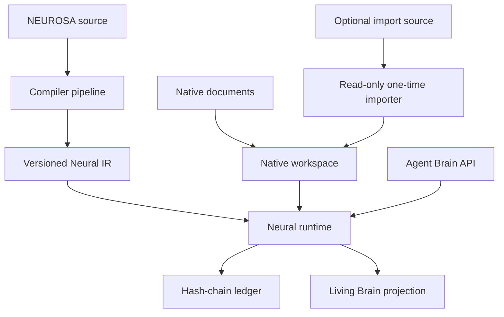

# NEUROSA-HB Architecture Lock v0.1

Status: **LOCKED**  
Product: NEUROSA Human Brain Runtime  
Positioning: Brain for Agentic Runtime  
License: MIT

## 1. Purpose

NEUROSA-HB is an independent, local-first, programmable cognitive layer for agentic runtimes. The v0.1 product compiles `.nsa` source into deterministic Neural IR, loads it into a bounded event-driven runtime and keeps documents, memory, runtime state and an auditable hash-chain ledger in its own native storage. Obsidian is an optional one-time import source, never a runtime dependency.

It is not an agent, agent framework, generic RAG system, vector database, Hydra dashboard, Hermes module, or Michael Angelo component.

## 2. Primary principle

Persistent, plastic, and auditable cognition. Every mutation requires a computational contract, provenance, policy decision, and ledger evidence. Missing provenance is `UNKNOWN`, never guessed.

## 3. Trust boundaries

1. Operator approval controls persistent inferred relations and destructive native-memory mutations.
2. Agents have explicit identities, namespaces, trust, and deny-by-default mutation permissions.
3. Untrusted `.nsa` must pass lexing, parsing, semantic analysis, and type checking before execution.
4. Imported content is untrusted data; scripts never execute and resolved paths stay inside the canonical import root.
5. Runtime activation is bounded by hops, event budget, minimum strength, timeout, cycles, and cancellation.
6. Storage is hidden behind repositories; normal APIs cannot rewrite ledger history.
7. UI is a read-only projection of persisted state and actual events.

## 4. Logical architecture

## 5. Components

- Compiler: lexer, parser, AST, semantics, type checker, IR, compiler, CLI.
- Domain/runtime: neurons, dendrites, axons, synapses, impulses, bounded propagation, plastic proposals.
- Memory: native Markdown documents, folders, revisions, tags, links, backlinks, FTS5 search, persistent brain state, provenance, evidence and ledger.
- Import: isolated read-only importers copy data into native storage and disconnect from their source.
- Integration: framework-neutral Brain API with agent policy.
- Delivery: local Next.js Living Brain UI driven by runtime state and event IDs.

## 6. Data formats and interfaces

Neural IR version `0.1` is canonical JSON with sorted entities and stable SHA-256 source hash. Thresholds, weights, confidence, salience, and activation are finite values in `[0,1]`; resting potential is `[-1,0]`. Runtime timestamps use ISO-8601 UTC. `AgentBrainRuntime` exposes recall, activation, observation, consolidation, working memory, proposal resolution, evidence, and trace inspection.

## 7. Operation flow

Source is hashed, parsed and checked; valid AST is lowered to IR. Runtime validates/loads IR and persists state. Native documents are revisioned and indexed locally with FTS5. Optional importers copy source material into native storage, resolve supported links and then release the source. Authenticated recall/activation creates bounded impulses and ledger events. Repeated coactivation may create only `PROPOSED` relations. UI consumes only persisted state and events.

## 8. Cryptography and security

SHA-256 binds source, document content, provenance and each ledger event to its predecessor. Canonical path validation and `realpath` prevent traversal and symlink escape during import. Markdown is data only. Original import sources are read-only. The hash chain detects modification but does not prevent a local administrator deleting the entire store; external anchoring is out of scope.

## 9. Network

Services bind to loopback by default. Core compiler/runtime need no network. There is no public admin API. Any remote adapter requires a change request and updated threat model.

## 10. Recovery

Runtime state and native documents are persisted in versioned SQLite migrations and recovered after restart. Documents keep immutable revision snapshots, soft deletion and restoration. Ledger recovery verifies the full chain before accepting new events. Backup and restore operate on the native store; corruption halts mutation. Code rollback uses `git revert`.

## 11. Security invariants

Invalid source never executes; import paths never escape their root; documents never execute code; original import sources are never modified; persistent inferred relations require explicit approval; declared relations are never silently pruned; every accepted mutation appends evidence; activation is finite; agent working memory is isolated; mutation is deny-by-default; UI state comes from real events.

## 12. Repository structure

`apps/` contains delivery boundaries. `packages/` contains compiler, document and runtime domains, native workspace, storage, ledger, API contracts and integrations. `examples/` holds executable fixtures. `tests/` holds compiler, workspace, runtime, integration, security, API, UI and vertical E2E validation. `docs/` holds locked specifications.

No external graph database is permitted. Storage stays behind repository interfaces. The native store uses a stable SQLite driver, WAL, foreign keys, versioned migrations and FTS5.

## 13. Validation requirements

Formatting, typed lint, strict typecheck, compiler tests, deterministic IR, runtime/ledger/Vault/security/API tests, production build, vertical E2E, restart persistence, and local HTTP smoke must pass. Evidence includes exact commands, counts, paths, hashes, and remote commit SHAs.

## 14. Four real risks

1. **Pseudobiology:** labels can hide CRUD. Control: every mechanism needs input/output/configuration, implementation, deterministic test, and event.
2. **Graph pollution:** learned relations can become noise. Control: coactivation/evidence/confidence thresholds, deduplication, proposal state, approval, and pruning.
3. **Runaway activation:** cycles can consume resources. Control: hops, strength, visited edges, event budget, timeout, cancellation.
4. **Native data loss or hostile import:** a crash or crafted source can damage memory. Control: revisions, trash, transactions, WAL, backup/restore, read-only import, canonical paths, symlink and archive-boundary checks.

## 15. Locked decisions and out of scope

Locked: independent repository; `.nsa`; real compiler stages; versioned IR; local-first bounded runtime; explicit neural contracts; native Markdown workspace; Obsidian as optional one-time import only; append-only hash-chain ledger; deny-by-default mutations; pnpm, strict TypeScript, Turborepo, Node.js, stable SQLite adapter, Next.js/React, Zod, Vitest, ESLint, Prettier.

Out of scope: atom-level biological simulation, consciousness claims, runtime dependence on Obsidian, modification of an original Vault, public admin API, mandatory cloud, external graph database, model-provider lock-in, Hydra/Hermes/Michael Angelo ownership, external ledger anchoring. Material changes require operator-approved change control with migration, validation, and rollback impact.
